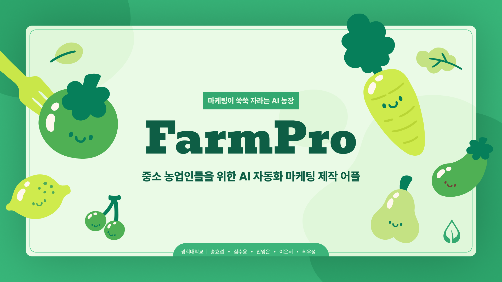

# FarmPro-Backend

## 프로젝트 소개

> FarmPro는 생성형 AI를 사용하여 농업 생산자에게 최적의 마케팅 전략을 제공합니다.  
> 이 레포지토리는 FarmPro의 Backend infra, ML Service를 담당합니다.



## API 문서

[API Documentation](https://port-0-farmpro-backend-lypd5head859a5e8.sel5.cloudtype.app/swagger-ui/index.html)

## 기술 스택

- `Java` 17
- `Spring Boot` 3.3.1
    - `Spring Data JPA`
    - `Spring WebFlux`
    - `Spring Cloud` 2020.0.3
    - `Spring Cloud AWS` 2.4.0

## 프로젝트 구조

```Bash

├── LICENSE
├── README.md
├── build
├── build.gradle
├── docs
├── gradle
├── gradlew
├── gradlew.bat
├── settings.gradle
└── src
    ├── java
│   └── artchain
│       └── farmpro
│           ├── FarmproApplication.java
│           ├── ai
│           │   ├── ChatGptConfiguration.java
│           │   ├── ChatGptWebClient.java
│           │   ├── dto
│           │   │   ├── ChatGptResponse.java
│           │   │   └── GPTRecommendResponse.java
│           │   └── prompt
│           │       ├── PromptContext.java
│           │       ├── PromptPropertyParser.java
│           │       ├── PromptStrategy.java
│           │       ├── SnsContentPromptStrategy.java
│           │       └── SnsImagePromptStrategy.java
│           ├── card
│           │   ├── Card.java
│           │   ├── CardRepository.java
│           │   ├── CardStyle.java
│           │   └── dto
│           │       ├── CardRequest.java
│           │       └── CardsRequest.java
│           ├── content
│           │   ├── Content.java
│           │   ├── ContentController.java
│           │   ├── ContentPurpose.java
│           │   ├── ContentRepository.java
│           │   ├── ContentService.java
│           │   ├── ContentType.java
│           │   ├── ParlanceStyle.java
│           │   ├── dto
│           │   │   ├── ContentCreateResponse.java
│           │   │   ├── ContentRecommendRequest.java
│           │   │   ├── ContentRecommendResponse.java
│           │   │   ├── ContentRequest.java
│           │   │   ├── ContentResponse.java
│           │   │   ├── ContentResponses.java
│           │   │   ├── ProjectInfoRequest.java
│           │   │   └── ProjectInfoResponse.java
│           │   └── image
│           │       ├── ContentImage.java
│           │       ├── ContentImageController.java
│           │       ├── ContentImageService.java
│           │       └── dto
│           │           ├── ContentImagePresignedUrlVO.java
│           │           ├── ContentImageResponse.java
│           │           ├── ContentImageResponses.java
│           │           └── NotifyContentImageSaveSuccessRequest.java
│           ├── crop
│           │   ├── Crop.java
│           │   ├── CropController.java
│           │   ├── CropRepository.java
│           │   ├── CropService.java
│           │   └── dto
│           │       ├── CropRequest.java
│           │       ├── CropResponse.java
│           │       └── CropResponses.java
│           ├── global
│           │   ├── config
│           │   │   ├── S3Config.java
│           │   │   ├── SwaggerConfig.java
│           │   │   └── WebConfig.java
│           │   └── health
│           │       └── HealthController.java
│           └── selectedcrop
│               ├── SelectedCrop.java
│               └── SelectedCropRepository.java

